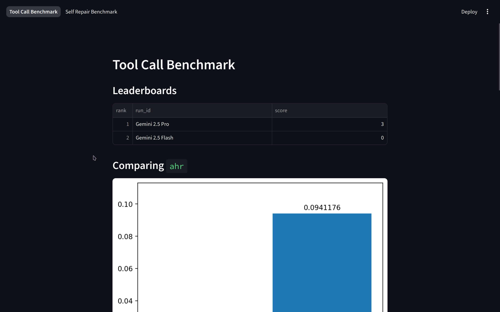

# **A.B.E.T. — Agent Benchmark & Evaluation Toolkit**

> **Note:** This project is a work in progress. Core functionality is implemented, and additional documentation & logging are being added.

A.B.E.T. (Agent Benchmark & Evaluation Toolkit) is a lightweight, modular framework for **building, running, and analyzing LLM agent benchmarks**. It provides a complete pipeline—from dataset loading to agent execution, evaluation, and visualization—making it easy to design custom benchmarks or plug in prebuilt ones.

The goal is to offer a flexible, extensible environment for evaluating **agentic behavior**, **tool-call reliability**, **self-repair**, and other emerging LLM capabilities.

---

## **Live Demo**

The dashboard is hosted on Streamlit:
**[https://abet-sxm.streamlit.app](https://abet-sxm.streamlit.app)**

---

## **Project Structure**

```py
|__ benchmark/                          # Benchmarks live here
|   |__ utils.py                        # run() + shared benchmark utilities
|   |__ init/                           # Template generator: benchmark.init
|   |   |__ __main__.py
|   |   |__ placeholder_config.yaml
|   |   |__ placeholder_init.py
|   |   |__ placeholder_main.py
|   |__ tool_call/                      # Tool-call evaluation benchmark
|   |__ self_repair/                    # (Optional) Self-repair benchmark
|
|__ core/                               # Core abstractions and runtime
|   |__ agentoutput.py                  # AbstractAgentOutput
|   |__ dataset.py                      # AbstractDataset
|   |__ evaluation.py                   # AbstractEvaluation
|   |__ message.py                      # Standard message types
|   |__ agentbuilder/                   # AgentBuilder implementations
|   |__ agentrunner/                    # Runners: sync + async
|   |   |__ synchronous.py              # Sequential, multithreaded, multiprocessing
|   |   |__ asynchronous.py             # Async sequential & concurrent runners
|   |__ datasetloader/                  # DatasetLoader base
|   |__ evaluationsaver/                # EvaluationSaver base
|   |__ translator/                     # Output→Message translators
|
|__ dashboard/                          # Streamlit-powered dashboard
|   |__ app.py                          # Main UI
|   |__ utils.py                        # Dashboard utilities
|   |__ config.yaml                     # Dashboard configuration
|
|__ evaluations/                        # Stored evaluation results
|
|__ README.md                           # You are here
```

---

## **End-to-End System Flow**


1. **AgentBuilder** constructs an agent from configuration.
2. **DatasetLoader** loads a dataset into a standardized Dataset object.
3. **Translator** converts raw agent outputs into normalized Message objects.
4. **AgentRunner** executes the agent across the dataset (sync, threaded, multiprocess, or async).
5. The dataset is populated with outputs and passed to an **Evaluator**.
6. The **Evaluator** produces an Evaluation object.
7. **EvaluationSaver** exports or stores the evaluation (JSON, dashboard results, etc.).

This architecture allows *any* benchmark to be defined through simple config files and modular Python components.

---

## **Setup**

```sh
git clone https://github.com/saksham1341/abet
cd abet
python -m pip install -r requirements.txt
```

---

## **Running a Benchmark**

Each benchmark can be executed directly as a Python module:

```sh
python -m benchmark.tool_call
```

Benchmarks are configured via the `config.yaml` file inside their directory.
This includes:

* agent builder class
* runner type (sync/async/threaded/process)
* evaluator class
* evaluation saver configuration
* dataset path
* translator class

---

## **Dashboard Overview**

If a benchmark uses
`core.evaluationsaver.DashboardEvaluationSaver`
and saves results under `evaluations/`, the Streamlit dashboard can visualize:

* model comparisons
* multiple runs of a benchmark
* per-metric analysis
* leaderboard-style views

Minimal example snippet:

```yaml
evaluationsaver_class: core.evaluationsaver.DashboardEvaluationSaver
evaluationsaver_config:
    benchmark_name: *benchmark_name
    run_id: *model_name
    output_path: "evaluations/my_run.json"
```

Launch the dashboard:

```sh
streamlit run dashboard_app.py
```

Example (Tool-Call Benchmark):



Customize dashboard behavior through `dashboard/config.yaml`.

---

## **Built-In Benchmarks**

### **1. Tool-Call Benchmark**

Evaluates:

* correct tool selection
* correctness of tool arguments
* structure of tool-call messages

Useful for testing **agentic grounding**, **API usage**, and **tool reliability**.

---

### **2. Self-Repair Benchmark** *(optional WIP)*

Evaluates:

* the model’s ability to detect its own errors
* correctness of self-corrections
* robustness under iterative feedback

Useful for studying **model introspection and failure recovery**.

---

## **Status**

✔ Core architecture implemented
✔ Sync & async runners
✔ Dashboard with run comparison
✔ Example benchmarks included (in progress)
⬜ Documentation (in progress)
⬜ Logging & robustness improvements (ongoing)
