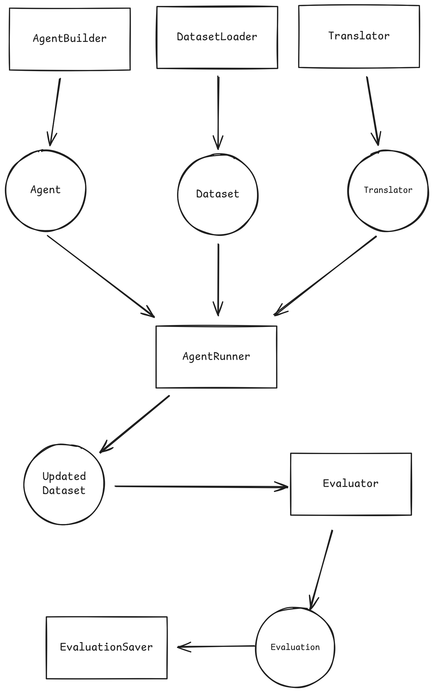

# **A.B.E.T. — Agent Benchmark & Evaluation Toolkit**

> **Note:** This project is a work in progress. Core functionality is implemented, and additional documentation & logging are being added.

A.B.E.T. (Agent Benchmark & Evaluation Toolkit) is a lightweight, modular framework for **building, running, and analyzing LLM agent benchmarks**. It provides a complete pipeline—from dataset loading to agent execution, evaluation, and visualization—making it easy to design custom benchmarks or plug in prebuilt ones.

The goal is to offer a flexible, extensible environment for evaluating **agentic behavior**, **tool-call reliability**, **self-repair**, and other emerging LLM capabilities.

---

## **Live Demo**

The dashboard is hosted on Streamlit:
**[https://sxm-abet.streamlit.app](https://sxm-abet.streamlit.app)**

---

## **End-to-End System Flow**



ABET uses **6 core components** to evaluate an agent.

| Module            | Responsibility                                                  |
| ----------------- | --------------------------------------------------------------- |
| `DatasetLoader`   | Loads raw data from files/APIs into a unified dataset structure |
| `AgentBuilder`    | Builds an agent (LLM interface, model config, tools)            |
| `AgentRunner`     | Executes the agent across the dataset (async or sync)           |
| `Translator`      | Converts model-native outputs → internal structured messages    |
| `Evaluator`       | Computes metrics and gathers sample-level diagnostics           |
| `EvaluationSaver` | Saves results for dashboard ingestion                           |

This architecture allows *any* benchmark to be defined through simple config files and modular Python components.

---

## **Project Structure**

```py
|__ benchmark/                          # Benchmarks live here
|   |__ utils.py                        # run() + shared benchmark utilities
|   |__ init/                           # Template generator: benchmark.init
|   |   |__ __main__.py
|   |   |__ placeholder_config.yaml
|   |   |__ placeholder_init.py
|   |   |__ placeholder_main.py
|   |__ kmmlu/                          # KMMLU Benchmark
|   |__ tool_call/                      # Tool-call evaluation benchmark
|   |__ self_repair/                    # Self-repair benchmark
|
|__ core/                               # Core abstractions and runtime
|   |__ agentoutput.py                  # AbstractAgentOutput
|   |__ dataset.py                      # AbstractDataset
|   |__ evaluation.py                   # AbstractEvaluation
|   |__ message.py                      # Standard message types
|   |__ agentbuilder/                   # AgentBuilder implementations
|   |__ agentrunner/                    # Runners: sync + async
|   |   |__ synchronous.py              # Sequential, multithreaded, multiprocessing
|   |   |__ asynchronous.py             # Async sequential & concurrent runners
|   |__ datasetloader/                  # DatasetLoader base
|   |__ evaluationsaver/                # EvaluationSaver base
|   |__ translator/                     # Output→Message translators
|
|__ dashboard/                          # Streamlit-powered dashboard
|   |__ app.py                          # Main UI
|   |__ utils.py                        # Dashboard utilities
|   |__ config.yaml                     # Dashboard configuration
|
|__ evaluations/                        # Stored evaluation results
|
|__ README.md                           # You are here
```

---

## Available Benchmarks

| Benchmark             | Focus                                                               | Details                   |
| --------------------- | ------------------------------------------------------------------- | ------------------------ |
| KMMLU Benchmark       | Korean-language knowledge & reasoning multiple-choice exam          | [KMMLU Benchmark's README.md](benchmark/kmmlu/)                 |
| Tool Call Benchmark   | Agentic tool selection, argument correctness, trajectory similarity | [Tool Call Benchmark's README.md](benchmark/tool_call/)          |
| Self-Repair Benchmark | Iterative debugging using `run_code`                                | [Self Repair Benchmark's README.md](benchmark/self_repair/) |

Each benchmark has its **own README** inside its folder explaining the pipeline.

---

## **Setup**

```sh
git clone https://github.com/saksham1341/abet
cd abet
python -m pip install -r requirements.txt
```

---

## **Running a Benchmark**

Each benchmark can be executed directly as a Python module:

```sh
python -m benchmark.tool_call
```

Benchmarks are configured via the `config.yaml` file inside their directory.
This includes:

* agent builder class
* runner type (sync/async/threaded/process)
* evaluator class
* evaluation saver configuration
* dataset path
* translator class

---

## **Adding a New Benchmark**

1. run `python -m benchmark.init <your_benchmark_name>`
2. Add your dataset loader
3. Implement your translator + agent output dataclass
4. Write an evaluator + evaluation dataclass
5. Fill the `config.yaml`
6. Add dashboard metadata

A.B.E.T. handles the rest.

---

## **Dashboard Overview**

If a benchmark uses
`core.evaluationsaver.DashboardEvaluationSaver`
and saves results under `evaluations/`, the Streamlit dashboard can visualize:

* model comparisons
* multiple runs of a benchmark
* per-metric analysis
* leaderboard-style views

Minimal example snippet:

```yaml
evaluationsaver_class: core.evaluationsaver.DashboardEvaluationSaver
evaluationsaver_config:
    benchmark_name: *benchmark_name
    run_id: *model_name
    metrics:
        - metric_1
        - metric_2
    output_dir: "evaluations"
```

Launch the dashboard:

```sh
streamlit run dashboard_app.py
```

Customize dashboard behavior through `dashboard/config.yaml`.

---

## Future developments

- Implementing a BFCL benchmark (v1 for now, expand later)
- Documentation
- command line config customization
